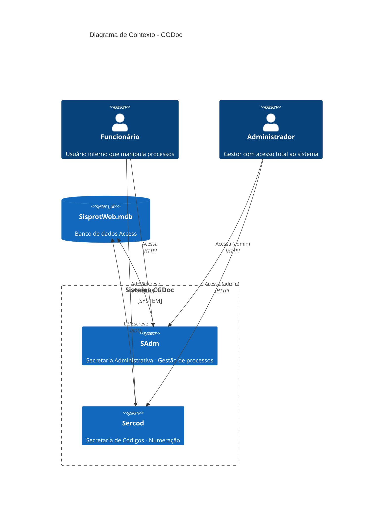
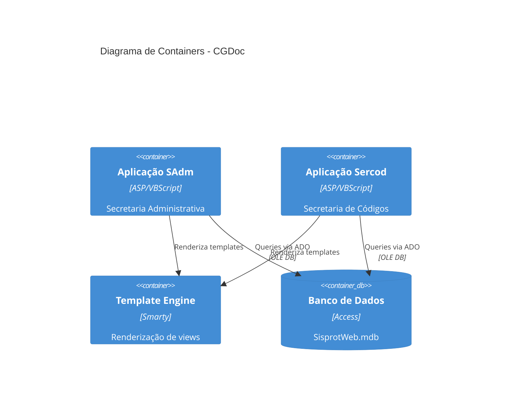
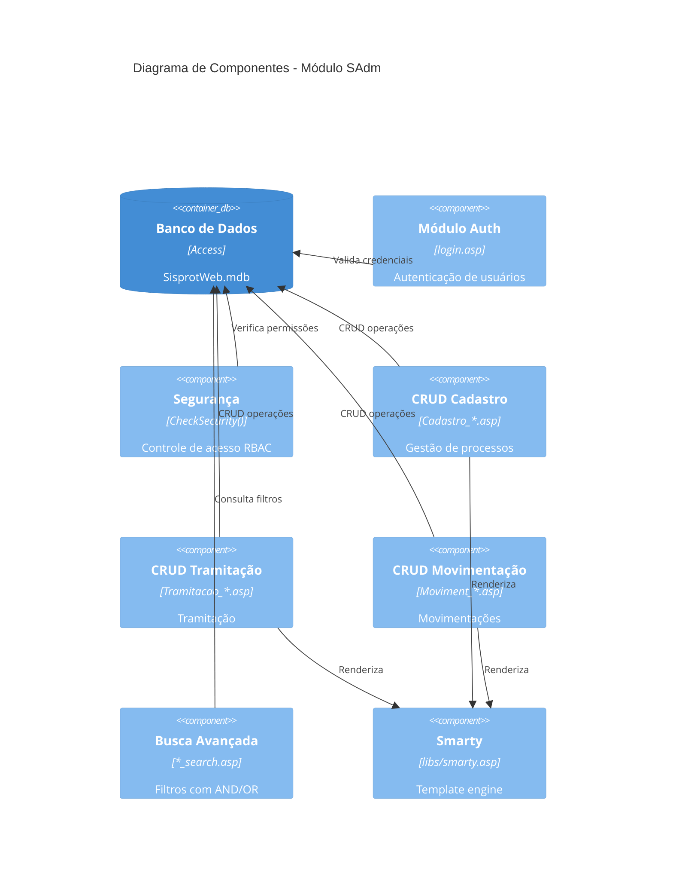

# Arquitetura — Projeto CGDoc

> Gerado pelo Reversa Architect em 2026-05-06
> Nível de Documentação: Completo

## Visão Geral do Sistema

Sistema web legado para gestão de processos e protocolos governamentais.
Duas secretarias: **SAdm** (Administrativa) e **Sercod** (Códigos).

### Stack Tecnológico

| Componente | Tecnologia |
|------------|------------|
| Frontend | ASP Clássico + Smarty Templates |
| Backend | ASP/VBScript (IIS) |
| Banco de Dados | Microsoft Access (.mdb) |
| Servidor Web | IIS (Windows) |

---

## Diagrama C4 — Contexto



---

## Diagrama C4 — Containers



---

## Diagrama C4 — Componentes (SAdm)



---

## Entidades e Relacionamentos

| Entidade | Descrição |
|----------|-----------|
| **Usuários** | Autenticação e controle de acesso |
| **Cadastro** | Processos principais |
| **Tramitação** | Encaminhamentos entre departamentos |
| **Movimentação** | Histórico de ações em processos |
| **_AudMoviment** | Auditoria de movimentações |

### Relacionamentos Inferidos

```
Usuários 1:N Cadastro
Usuários 1:N Tramitação
Usuários 1:N Movimentação
Cadastro 1:N Tramitação
Cadastro 1:N Movimentação
```

---

## Integrações Externas

| Sistema | Tipo | Protocolo | Descrição |
|---------|------|-----------|------------|
| **SisprotWeb.mdb** | Banco de dados | OLE DB/ADO | Acesso via driver Access |

> Não há APIs REST, serviços externos ou webhooks. Sistema isolado.

---

## Dívidas Técnicas

| Item | Severidade | Descrição |
|------|------------|-----------|
| **ASP Clássico** | Alta | Tecnologia obsoleta, difícil manutenção |
| **Access como DB** | Alta | Não escala, problemas de concorrência |
| **Código duplicado** | Média | ~100 arquivos por módulo seguem mesmo padrão |
| **Sem testes** | Alta | Ausência completa de testes automatizados |
| **Sem versionamento** | Média | Não há histórico Git disponível |
| **Senha em texto** | Crítica | Segurança de credenciais desconhecida |

---

## Confiança

| Símbolo | Significado |
|---------|-------------|
| 🟢 CONFIRMADO | Extraído diretamente do código |
| 🟡 INFERIDO | Baseado em padrões e nomes |
| 🔴 LACUNA | Informação não disponível |