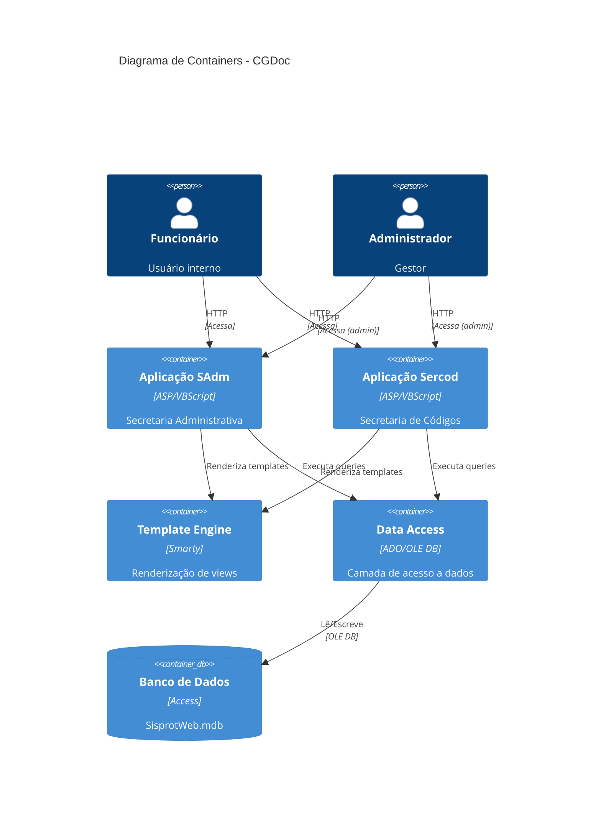

# C4 - Containers

> Diagrama C4 Nível 2: Containers

## Tecnologias por Container

| Container | Tecnologia | Responsabilidade |
|-----------|------------|------------------|
| Aplicação SAdm | ASP/VBScript | Lógica de negócio - Secretaria Administrativa |
| Aplicação Sercod | ASP/VBScript | Lógica de negócio - Secretaria de Códigos |
| Template Engine | Smarty | Separação view/controller |
| Data Access | ADO/OLE DB | Abstração de banco de dados |
| Banco de Dados | Access | Persistência |

## Comunicações

| De | Para | Protocolo |
|----|------|-----------|
| Navegador | ASP | HTTP/HTTPS |
| ASP | Smarty | Chamada interna |
| ASP | ADO | COM Interface |
| ADO | Access | OLE DB Provider |