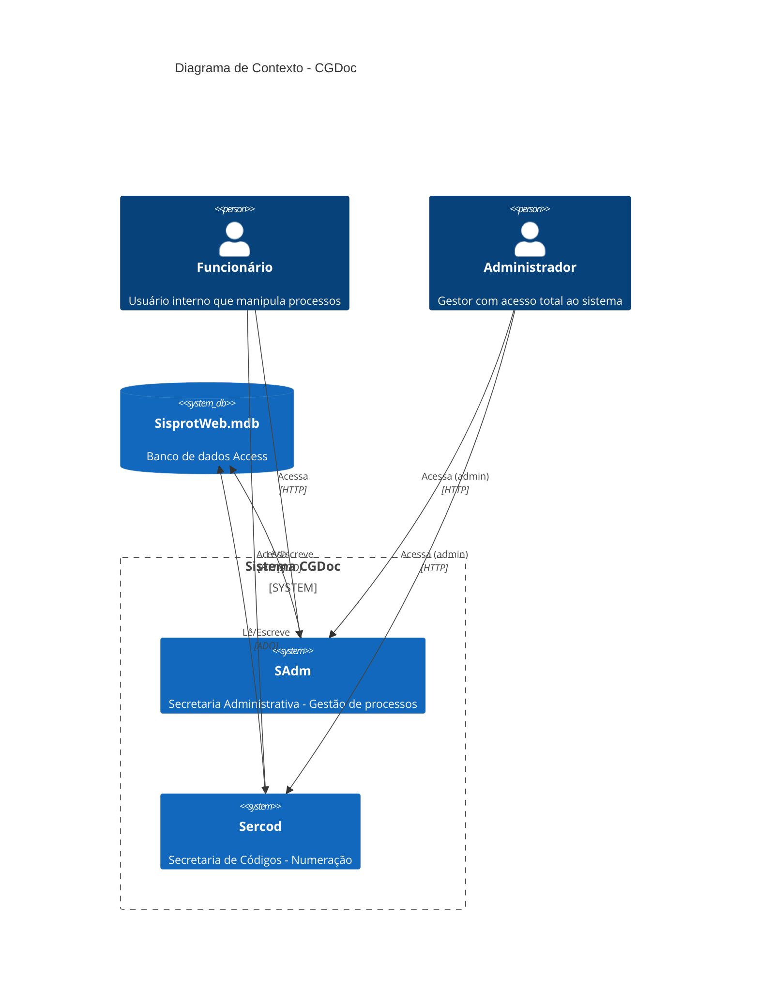

# C4 - Contexto

> Diagrama C4 Nível 1: Contexto do Sistema

## Legenda

| Elemento | Significado |
|----------|-------------|
| Person | Usuário do sistema |
| System | Aplicação CGDoc |
| SystemDb | Banco de dados |
| Rel | Relacionamento com protocolo |

## Descrição

- **Funcionários** acessam o sistema via HTTP para gerenciar processos
- **Administradores** têm acesso irrestrito (bypass de permissões)
- **SAdm** e **Sercod** compartilham o mesmo banco de dados Access
- Comunicação interna via ADO/OLE DB