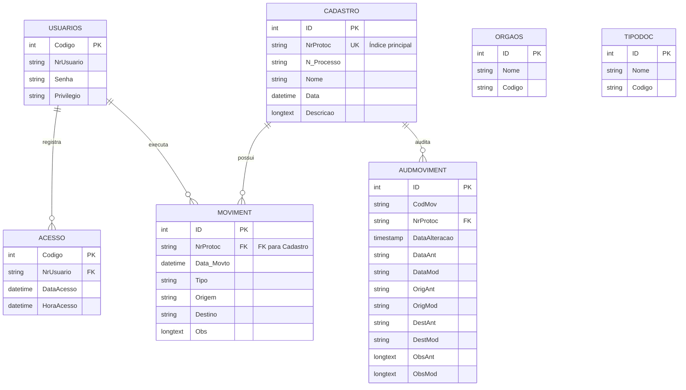

# ERD — Banco de Dados CGDoc



---

## Descrição dos Relacionamentos

| De | Para | Cardinalidade | Descrição |
|----|------|---------------|-----------|
| Usuários | Acesso | 1:N | Cada usuário pode ter múltiplos logs de acesso |
| Usuários | Moviment | 1:N | Cada usuário registra movimentações |
| Cadastro | Moviment | 1:N | Cada processo pode ter múltiplas movimentações |
| Cadastro | _AudMoviment | 1:N | Auditoria de alterações em processos |

---

## Integração entre Bancos (Tramitação)

O banco **Sercod_SAdm** é usado para tramitação entre SAdm e Sercod:

```
SAdm.Cadastro ──tramitação──> Sercod_SAdm.Cadastro
        │                              │
        └─────────────<──────────────┘
              (mesmo NrProtoc)
```

### Fluxo de Tramitação
1. Processo criado em SAdm com NrProtoc = `sadm-0000001`
2. Processo tramitado para Sercod
3. Registro em Sercod_SAdm com o mesmo NrProtoc
4. Visualização unificada via prefixo

---

## Observações

- **Uk** = Unique Key (índice único)
- **FK** = Foreign Key (relacionamento implícito via NrProtoc)
- Todas as tabelas têm `ID` AUTO_INCREMENT como PK
- NrProtoc é UK em Cadastro (identificador de negócio)