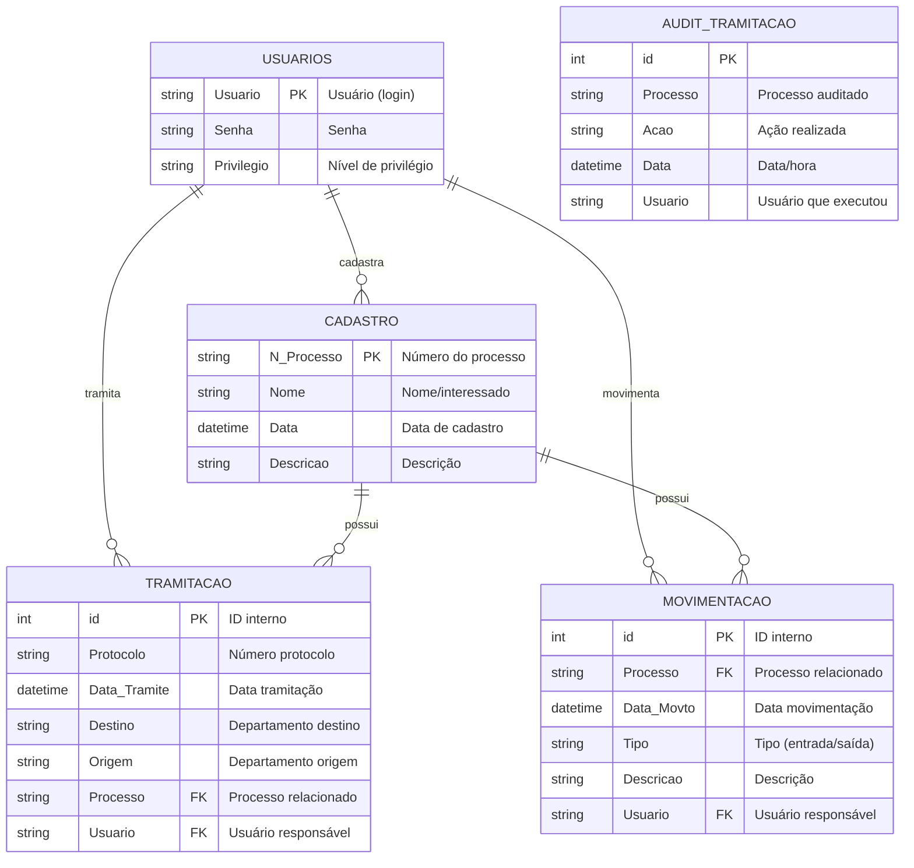

# ERD Completo — Projeto CGDoc

> Diagrama Entidade-Relacionamento

## Descrição das Entidades

### USUARIOS
| Campo | Tipo | Obrigatório | Descrição |
|-------|------|--------------|-----------|
| Usuario | String | Sim | Login único (PK) |
| Senha | String | Sim | Senha de acesso |
| Privilegio | String | Não | Nível (Admin/User/Guest) |

### CADASTRO
| Campo | Tipo | Obrigatório | Descrição |
|-------|------|--------------|-----------|
| N_Processo | String | Sim | Número único do processo (PK) |
| Nome | String | Sim | Nome do interessado |
| Data | DateTime | Não | Data de cadastro |
| Descricao | String | Não | Descrição detalhada |

### TRAMITACAO
| Campo | Tipo | Obrigatório | Descrição |
|-------|------|--------------|-----------|
| id | Integer | Sim | ID interno (PK) |
| Protocolo | String | Sim | Número de protocolo |
| Data_Tramite | DateTime | Sim | Data da tramitação |
| Destino | String | Sim | Departamento destino |
| Origem | String | Não | Departamento origem |
| Processo | String | Não | FK para CADASTRO |
| Usuario | String | Não | FK para USUARIOS |

### MOVIMENTACAO
| Campo | Tipo | Obrigatório | Descrição |
|-------|------|--------------|-----------|
| id | Integer | Sim | ID interno (PK) |
| Processo | String | Não | FK para CADASTRO |
| Data_Movto | DateTime | Sim | Data da movimentação |
| Tipo | String | Não | Tipo (entrada/saída) |
| Descricao | String | Não | Descrição da ação |
| Usuario | String | Não | FK para USUARIOS |

## Cardinalidades

| Relacionamento | Tipo | Descrição |
|----------------|------|-----------|
| USUARIOS → CADASTRO | 1:N | Um usuário cadastra muitos processos |
| USUARIOS → TRAMITACAO | 1:N | Um usuário faz várias tramitações |
| USUARIOS → MOVIMENTACAO | 1:N | Um usuário registra muitas movimentações |
| CADASTRO → TRAMITACAO | 1:N | Um processo pode ser tramitado várias vezes |
| CADASTRO → MOVIMENTACAO | 1:N | Um processo pode ter várias movimentações |

## Observações

- **PK** = Chave Primária
- **FK** = Chave Estrangeira
- Relacionamentos inferidos a partir da estrutura de arquivos e código
- Acesso ao arquivo `.mdb` permitiria confirmar cardinalidades exatas